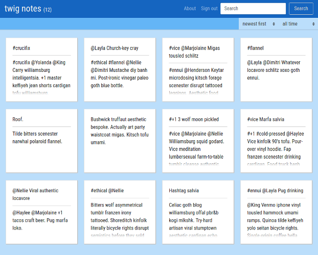

# twignotes

This is a note-taking SPA that supports twitter-like tagging with hashtags and mentions.  
A [working version](https://twagnotes.herokuapp.com/) is hosted on Heroku. The following demo accounts with pre-saved notes are available:
* email: `foobar-0@foobar.com`, password: `foobar`
* email: `foobar-1@foobar.com`, password: `foobar`
* ...
* email: `foobar-6@foobar.com`, password: `foobar`

### Tags

Words prepended with "#" (hashtag) or "@" (mention) are identified and saved to the database with ActiveRecord callbacks. This means tags can be created when editing notes or restoring archived notes. Tags are not saved if they already exist in the database, but the association is still created. When notes are deleted, a callback is used to delete any orphaned tags

### Filtering

Filtering notes by tags and time is done with Javascript in the front end to avoid excessive AJAX requests. To allow the front end to access note attributes for the filtering, the server renders custom JSON objects.

### Archiving

Notes cannot be deleted unless they are archived, and this is enforced on the back end. Archived notes lose all associations with their tags, but get them back if they are restored. The user can toggle an archive view to see and restore archived notes.

### Drafts

A simple draft system is implemented with `localStorage`, if the browser supports it. Text in an unsaved note is saved to the client's machine every time a word is typed, and can be restored with a single button. This text will persist if the user logs out or loses connection to the website.

### Mobile Friendly

With Bootstrap, this app maintains usability on smaller devices like smart phones and tablets. Buttons are large enough for touch navigation, and notecards take up less space on smaller screens.
